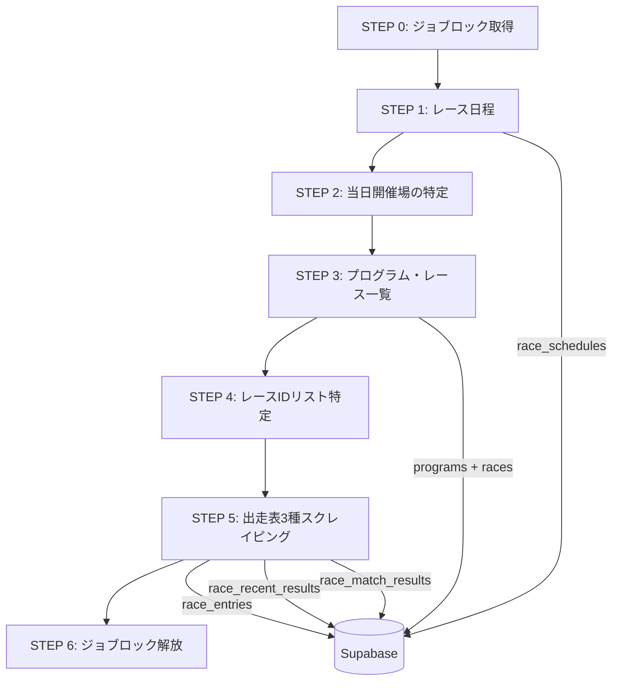

# 🏆 スクレイピング機能 設計書（バイブル）

> **目的**: 本設計書は `keirin.netkeiba.com` からのWebスクレイピング機能の全体設計を体系的にまとめたものです。  
> 同様の機能を新たに実装する際のバイブルとして使用し、**過去の失敗を繰り返さない**ことを目的とします。

---

## 1. アーキテクチャ全体像

### 1.1 レイヤー構成

```
┌───────────────────────────────────────────────────┐
│  API Route (trigger/route.ts)                     │
│  └─ GitHub Actions workflow_dispatch → 非同期実行  │
├───────────────────────────────────────────────────┤
│  Service Layer (scrapeService.ts)                 │
│  └─ オーケストレーション・STEP管理・エラー集約     │
├───────────────────────────────────────────────────┤
│  Scraper Layer (src/lib/scrapers/*.ts)            │
│  └─ HTML取得 → Cheerio解析 → 型付きデータ生成     │
├───────────────────────────────────────────────────┤
│  Repository Layer (src/lib/repositories/*.ts)     │
│  └─ Supabase UPSERT / SELECT / DELETE             │
├───────────────────────────────────────────────────┤
│  Type Layer (src/types/*.ts)                      │
│  └─ テーブル型定義 + Input型（INSERT/UPSERT用）    │
├───────────────────────────────────────────────────┤
│  Utility Layer (src/lib/utils/*.ts)               │
│  └─ 日付変換・安全型変換・グレード判定             │
└───────────────────────────────────────────────────┘
```

### 1.2 データフロー（STEP別パイプライン）



---

## 2. 共通基盤：HTTP取得と遅延制御

### 2.1 fetchPage（[fetchUtils.ts](file:///home/dev/project/cycleboy/src/lib/scrapers/fetchUtils.ts)）

| 項目 | 仕様 |
|------|------|
| ライブラリ | Axios + Cheerio |
| ベースURL | `https://keirin.netkeiba.com` |
| タイムアウト | 10秒（`DEFAULT_TIMEOUT_MS`） |
| リトライ | 最大3回、指数バックオフ（1s → 2s → 4s） |
| タイムアウト時 | **リトライなし、即時throw** |
| エンコーディング | `arraybuffer` → UTF-8 デコード |
| User-Agent | Chrome 120 偽装 |

> [!CAUTION]
> **タイムアウトとHTTPエラーの扱いが異なる。** タイムアウト（`ECONNABORTED`/`ERR_CANCELED`）はリトライせず即座にthrowする。これは無限にリトライしてサーバーに負荷をかけないための設計判断。

### 2.2 レートリミット制御（scrapeDelay）

```typescript
// 環境変数 SCRAPE_DELAY_MS で制御（デフォルト: 500ms）
export async function scrapeDelay(): Promise<void> {
    const ms = parseInt(process.env.SCRAPE_DELAY_MS ?? '500', 10);
    await sleep(ms);
}
```

> [!IMPORTANT]
> **全scraper関数で `fetchPage()` の直後に `scrapeDelay()` を呼ぶこと。** これにより対象サイトへの過剰なリクエストを防止する。呼び忘れるとレートリミットやIP BANのリスクがある。

---

## 3. STEP別 詳細設計

### 3.1 STEP 1: レース日程スクレイピング

**ファイル**: [raceScheduleScraper.ts](file:///home/dev/project/cycleboy/src/lib/scrapers/raceScheduleScraper.ts)  
**対象テーブル**: `race_schedules`  
**スコープ**: **グレードレース（GP〜G3）のみ登録。F1/F2は登録しない**

#### URL・セレクタマッピング

| 用途 | URL | セレクタ |
|------|-----|---------|
| グレード日程 | `/race/schedule/?kaisai_year={YYYY}&kaisai_month={MM}` | `.Race_Schedule_Table tr.schedule_list3` |

#### 行内td配置

| td index | 内容 | パース方法 |
|----------|------|-----------|
| 0 | 期間（`3/1(日)〜3/3(火)`） | 正規表現: `/(\\d+)\\/(\\d+)[^〜]*[〜～\\-].*?(\\d+)\\/(\\d+)/` |
| 1 | 開催名（レース名） | `.text().trim()` |
| 2 | グレードアイコン | `[class*="Icon_GradeType"]` → [gradeUtils.ts](file:///home/dev/project/cycleboy/src/lib/utils/gradeUtils.ts) で変換 |
| 3 | 競輪場リンク | `a[href*="jyo_cd"]` → 正規表現でjyo_cd抽出 |

#### グレード変換マップ（`gradeUtils.ts`）

```
Icon_GradeType1 → GP
Icon_GradeType2 → G1
Icon_GradeType3 → G2
Icon_GradeType4 → G3
Icon_GradeType5 → F1
Icon_GradeType6 → F2
```

#### 日付パース（年またぎ対応）

```typescript
// parsePeriod: baseMonth より6ヶ月以上離れた月は翌年として解釈
const startYear = startMonth < baseMonth - 6 ? baseYear + 1 : baseYear;
const endYear = endMonth < startMonth ? startYear + 1 : startYear;
```

> [!WARNING]
> **年をまたぐケース（12月→1月）の日付パース**に注意。`parsePeriod()`内のロジックは「基準月より6ヶ月以上小さい月は翌年」というヒューリスティックを使用している。テストケースで年またぎパターンを必ず検証すること。

---

### 3.2 STEP 3: レースプログラムスクレイピング

**ファイル**: [raceProgramScraper.ts](file:///home/dev/project/cycleboy/src/lib/scrapers/raceProgramScraper.ts)  
**対象テーブル**: `programs`, `races`

#### URL・セレクタマッピング

| 用途 | URL | セレクタ |
|------|-----|---------|
| プログラム | `/db/race_program/?kaisai_group_id={start_date(YYYYMMDD)+jyo_cd}` | `.Tab_RaceDaySelect li a[data-kaisai_date]` |
| レース一覧 | 同上 | `.RaceList_Main_Box` |
| 開催区分 | `/race/course/calendar.html?kaisai_year=...&kaisai_month=...&jyo_cd=...&kaisai_type=1` | `.Calendar_DayList li`, `.Icon_RaceMark` |

#### `kaisai_group_id` の構築ルール

```typescript
// 基本ルール: start_date(ハイフン除去) + jyo_cd
const kaisai_group_id = schedule.start_date.replace(/-/g, '') + jyo_cd;
// 例: "2026-03-01" + "44" → "2026030144"
```

#### レース情報の抽出

| 要素 | セレクタ/パース方法 |
|------|-------------------|
| レースID | `a[href]` から `/race_id=([0-9A-Za-z]+)/` |
| レース番号 | `.Race_Num span` → 数値のみ抽出 |
| レースタイトル | `.Race_Name` テキスト |
| 車立数 | `.Race_Data` から `/(\\d+)車/` |
| 発走・締切時刻 | `.Race_Data` から `/(\\d{1,2}:\\d{2})/g` で全角→半角変換後抽出 |

> [!IMPORTANT]
> **全角数字・コロンの半角変換が必須。** ネットケイリンでは時刻が全角文字で記載されることがある。`replace(/[０-９：]/g, (s) => String.fromCharCode(s.charCodeAt(0) - 0xfee0))` で変換すること。

#### `data-kaisai_date` のパース（可変桁数対応）

```typescript
// parseKaisaiDate: YYYYMD〜YYYYMMDD（4〜8桁）に対応
// "2026228" → "2026-02-28"
// "20261001" → "2026-10-01"
```

| rest.length | 解釈 | 例 |
|-------------|------|-----|
| 4 | MMDD | `"1001"` → `10月01日` |
| 3 | MDD（月1桁, 日2桁） | `"228"` → `02月28日` |
| 2 | MD（月1桁, 日1桁） | `"31"` → `03月01日` |

> [!CAUTION]
> **`data-kaisai_date` の桁数が可変**であることが過去の不具合の原因となった。`parseKaisaiDate()`がこの可変形式を正しく処理するが、3桁の場合に「MMD（月2桁, 日1桁）vs MDD（月1桁, 日2桁）」の曖昧性がある。現在は「月1桁」として解釈しているため、10月以降の1桁日は誤パースの可能性がある。テスト時に10月台のデータを要確認。

#### 開催区分の判定

| クラス名 | 開催区分 | 確認状況 |
|---------|---------|---------|
| `.MidNight` | ミッドナイト | ✅ 確認済み |
| `.Morning` | モーニング | ⚠️ 推測 |
| `.Night` | ナイター | ⚠️ 推測 |
| `.Girls` | ガールズ | ⚠️ 推測 |

推測クラス名には `aria-label` / SVG `title` でのフォールバック判定を実装済み。

---

### 3.3 STEP 5-A: 出走表（基本情報）スクレイピング

**ファイル**: [raceEntryScraper.ts](file:///home/dev/project/cycleboy/src/lib/scrapers/raceEntryScraper.ts)  
**対象テーブル**: `race_entries`

#### URL・セレクタ

| 用途 | URL | セレクタ |
|------|-----|---------|
| 出走表 | `/race/entry/?race_id={race_id}` | `tr.PlayerList` |
| 並び予想 | 同上 | `.DeployYosoWrap .DeployBox.Grid3 .DeployInBox` |

#### 選手行 td配置（22列）

| td | フィールド | パース方法 |
|----|-----------|-----------|
| 0 | `waku_no`（枠番） | `toIntSafe()` |
| 1 | `sha_no`（車番） | `toIntSafe()` ※0ならスキップ |
| 2 | スキップ | チェックボックス |
| 3 | スキップ | 印アイコン |
| 4 | 選手情報 | 複合パース（下記詳細） |
| 5 | `score`（競走得点） | `toFloatSafe()` |
| 6 | `leg_type`（脚質） | span/div除去後テキスト |
| 7-8 | `sprint_count`, `back_count` | `toIntSafe()` |
| 9-12 | `nige`, `makuri`, `sashi`, `mark` | `toIntSafe()` |
| 13-16 | `rank1`〜`rank3`, `out_of_rank` | `toIntSafe()` |
| 17-19 | `win_rate`〜`third_rate` | `toFloatSafe()` |
| 20 | `gear_ratio` | `toFloatSafe()` |
| 21 | `comment` | 空文字→null |

#### 選手情報（td[4]）の複合パース

```
.PlayerName  → clone → children除去 → テキスト取得
.PlayerFrom  → "東京/35歳" → 正規表現で prefecture + age 分離
.PlayerClass → "99期 / S1"  → 全角→半角変換後、kinen + class_rank 抽出
```

> [!WARNING]
> **`.PlayerName` のパースには `.clone()` → `.children().remove()` が必須。** 直接 `.text()` すると子要素のテキスト（アイコンテキスト等）が混入する。これは出走表・直近成績の両方で共通のパターン。

#### 並び予想パース

```
.DeployInBox を順番に走査:
  - .WakuSeparat あり → ライン区切り（現在のラインを確定）
  - .Shaban_Num テキスト → 車番としてラインに追加

出力: { lines: [{ sha_nos: [1,2,3] }, { sha_nos: [4,5] }, ...] }
```

---

### 3.4 STEP 5-B: 出走表（直近成績）スクレイピング

**ファイル**: [raceRecentResultScraper.ts](file:///home/dev/project/cycleboy/src/lib/scrapers/raceRecentResultScraper.ts)  
**対象テーブル**: `race_recent_results`

#### URL・セレクタ

| 用途 | URL | セレクタ |
|------|-----|---------|
| 直近成績 | `/race/entry/results.html?race_id={race_id}` | `tr.PlayerList` |

#### データ構造

```
選手ごとに:
├── current_session（今節成績） → JSONB
│   └── races: [{ race_name, rank }]
├── recent1（直近1開催） → JSONB
│   └── { kaisai_date, grade, jyo_name, races: [...] }
├── recent2（直近2開催） → JSONB
└── recent3（直近3開催） → JSONB
```

#### 今節 vs 直近の判別ロジック

| 区分 | マーカー | 成績セル取得方法 |
|------|---------|-----------------|
| 今節 | `.detail_table_tbodyItem.GroupLeft` | `nextUntil('th.GroupLeft')` |
| 直近1〜3 | `th.detail_table_tbodyInner.GroupLeft` | `.next()` をループ |

#### 順位パース

```typescript
// 数値変換可能 → number、不可 → string（"落", "失" 等）
const rankNum = parseInt(rankText, 10);
const rank = isNaN(rankNum) ? rankText : rankNum;
```

> [!IMPORTANT]
> **順位フィールドの型は `number | string`。** 「落車」「失格」等の非数値順位が存在するため、`rank` フィールドには `number` と `string` の両方を許容する設計。DB側（JSONB）もこの動的型を受け入れる必要がある。

#### 競輪場名の抽出

```typescript
// 1. .JyoName スパンから直接取得
// 2. フォールバック: テキスト全体から日付・グレード表記を除去
```

---

### 3.5 STEP 5-C: 出走表（対戦表）スクレイピング

**ファイル**: [raceMatchResultScraper.ts](file:///home/dev/project/cycleboy/src/lib/scrapers/raceMatchResultScraper.ts)  
**対象テーブル**: `race_match_results`

#### URL・セレクタ

| 用途 | URL | セレクタ |
|------|-----|---------|
| 対戦表 | `/race/match_list/?race_id={race_id}` | `tr.PlayerList` |

#### td配置

| td | フィールド | 値のパターン |
|----|-----------|-------------|
| 0 | `waku_no` | 枠番 |
| 1 | `sha_no` | 車番 |
| 2 | チェックボックス | スキップ |
| 3 | `player_name` | `a` タグのテキスト |
| 4 | `total`（総合成績） | `"36-22"` / null |
| 5〜 | `vs_records`（対戦成績） | 動的列数（車立数に依存） |

#### vs_records のパターン

| セル値 | 格納値 | 意味 |
|--------|--------|------|
| `""` (空文字) | `null` | 対戦履歴なし |
| `"-"` | `"-"` | 自車番 |
| `"1-4"` | `"1-4"` | 勝-負の戦績 |

> [!TIP]
> **対戦表の列数は車立て数に依存して動的に変わる**（4車〜9車）。`tds.length - 5` で対戦成績列数を算出し、ループで処理する。ハードコーディングは厳禁。

---

## 4. オーケストレーション（scrapeService.ts）

### 4.1 STEP実行フロー

**ファイル**: [scrapeService.ts](file:///home/dev/project/cycleboy/src/lib/services/scrapeService.ts)

```
run(options) → step分岐  ※4つの実行モード
  ├── "all"      → STEP1 → STEP2 → STEP3 → STEP5
  ├── "schedule"  → STEP1 のみ
  ├── "program"   → STEP3 のみ
  └── "entry"     → STEP5 のみ
```

### 4.2 排他制御（ジョブロック）

```typescript
// job_runs テーブルで status='running' のレコードを検索
// 存在する場合はスキップ（二重実行防止）
```

### 4.3 エラー粒度と継続性

| 粒度 | 動作 | 理由 |
|------|------|------|
| STEP 1 失敗 | 全STEP停止 | 日程データなしでは以降のSTEP実行不可 |
| STEP 3 特定場失敗 | 他の場は継続 | 1競輪場の障害で全体を止めない |
| STEP 5 特定レース失敗 | 他のレースは継続 | 同上 |

### 4.4 STEP 5 の並列実行

```typescript
// 3種のスクレイパーを Promise.all で並列実行
const [entryResult, recentResults, matchResults] = await Promise.all([
    scrapeEntry(raceId),
    scrapeRecentResults(raceId),
    scrapeMatchResults(raceId),
]);

// DB登録も並列
await Promise.all([
    raceEntryRepo.upsertRaceEntries(entryResult.entries),
    raceRecentResultRepo.upsertRaceRecentResults(recentResults),
    raceMatchResultRepo.upsertRaceMatchResults(matchResults),
]);
```

> [!NOTE]
> STEP 5 ではレース単位で3種のスクレイピングを並列実行するが、**レース間は直列**。これにより対象サイトへの同時リクエスト数を最大3に抑えている。

---

## 5. データ永続化パターン

### 5.1 UPSERTキー一覧

| テーブル | UPSERTキー | リポジトリ |
|---------|-----------|----------|
| `race_schedules` | `(jyo_cd, start_date)` | [raceScheduleRepository.ts](file:///home/dev/project/cycleboy/src/lib/repositories/raceScheduleRepository.ts) |
| `programs` | `(race_schedule_id, kaisai_date)` | `programRepository.ts` |
| `races` | `(netkeiba_race_id)` | `raceRepository.ts` |
| `race_entries` | `(netkeiba_race_id, sha_no)` | [raceEntryRepository.ts](file:///home/dev/project/cycleboy/src/lib/repositories/raceEntryRepository.ts) |
| `race_recent_results` | `(netkeiba_race_id, sha_no)` | `raceRecentResultRepository.ts` |
| `race_match_results` | `(netkeiba_race_id, sha_no)` | `raceMatchResultRepository.ts` |

### 5.2 バッチ内重複除去

```typescript
// raceEntryRepository では同一バッチ内の重複キーを「後勝ち」で除去
function deduplicateByKey<T>(records: T[], keyFn: (r: T) => string): T[]
```

### 5.3 型定義パターン

```typescript
// テーブルの完全型（SELECT結果用）
export interface RaceEntry { id: string; ... ; created_at: string; }

// INSERT/UPSERT用の型（id, created_at を除外）
export type RaceEntryInput = Omit<RaceEntry, 'id' | 'created_at'>;
```

---

## 6. ユーティリティ関数リファレンス

### 6.1 安全型変換（[dateUtils.ts](file:///home/dev/project/cycleboy/src/lib/utils/dateUtils.ts)）

| 関数 | 用途 | 失敗時 |
|------|------|--------|
| `toIntSafe(value, fallback=0)` | 文字列→整数 | fallback値を返す |
| `toFloatSafe(value, fallback=0)` | 文字列→浮動小数点 | fallback値を返す |

> [!TIP]
> スクレイピングで取得したテキストは**必ず `toIntSafe()` / `toFloatSafe()` を使って変換すること。** `parseInt()` / `parseFloat()` を直接使うと、空文字やスペースで `NaN` が発生してDB挿入エラーとなる。

### 6.2 全角→半角変換パターン

```typescript
// 頻出パターン: 0xFEE0分ずらし
text.replace(/[Ａ-Ｚａ-ｚ０-９：]/g, (s) =>
    String.fromCharCode(s.charCodeAt(0) - 0xfee0)
);
```

---

## 7. 新規スクレイパー追加チェックリスト

新しいスクレイパーを追加する際は、以下の手順に従うこと：

### Phase 1: 設計

- [ ] 対象ページのURLパターンを確定する
- [ ] Chrome DevToolsで対象ページのHTML構造を調査する
- [ ] 取得対象のデータ項目と対応するCSSセレクタを一覧にまとめる
- [ ] **td indexのマッピング表**を作成し、ドキュメント化する
- [ ] 型定義（`src/types/xxx.ts`）を `Interface` + `Input` パターンで作成する

### Phase 2: 実装

- [ ] `src/lib/scrapers/xxxScraper.ts` を作成する
- [ ] `fetchPage()` + `scrapeDelay()` を使用する（直接axiosを呼ばない）
- [ ] 全角→半角変換が必要な箇所を特定し処理を追加する
- [ ] `toIntSafe()` / `toFloatSafe()` で安全に型変換する
- [ ] `.clone()` + `.children().remove()` パターンで不要な子要素テキストを除去する
- [ ] 各行を `try-catch` で包み、パースエラー時は該当行スキップとする
- [ ] `src/lib/repositories/xxxRepository.ts` を作成する（UPSERTキーを明確に定義）
- [ ] `scrapeService.ts` にオーケストレーションを追加する

### Phase 3: テスト・検証

- [ ] テストケーステキスト（実HTMLスニペット）を準備する
- [ ] **空データ**・**全角混在**・**欠損列**のエッジケースを含める
- [ ] 実際のページに対してスクレイパーを実行し、DB登録結果を確認する
- [ ] `player_name` 等のテキストフィールドに子要素テキストが混入していないか確認する

---

## 8. 過去の失敗事例と教訓

### 8.1 ❌ `player_name` に子要素テキストが混入

**原因**: `.PlayerName` に直接 `.text()` を使用した  
**修正**: `.clone()` → `.children().remove()` → `.text()`  
**教訓**: テキスト取得前に**必ず子要素を含むかDevToolsで確認**。含む場合はclone + removeパターンを使う

### 8.2 ❌ `total` / `vs_records` に誤ったデータが設定

**原因**: td indexの誤認（チェックボックス列・印アイコン列のカウント漏れ）  
**修正**: HTMLのtd構造を再調査し、正確なindexマッピングを作成  
**教訓**: **td indexは必ず実HTMLで確認し、スキップ列（チェックボックス等）を必ずドキュメント化する**

### 8.3 ❌ `jyo_name` が未設定・`rank` が誤った値

**原因**: 直近成績セクションのHTML構造理解が不十分  
**修正**: `th.GroupLeft` マーカーを起点とした兄弟要素走査ロジックに修正  
**教訓**: **ネストされた表構造ではマーカー要素を基準に相対位置で取得する**

### 8.4 ❌ 発走・締切時刻が `00:00` になる

**原因**: 全角の時刻テキスト（`１０：３０`）に対して半角前提の正規表現を適用  
**修正**: テキスト取得後に全角→半角変換を追加  
**教訓**: **ネットケイリンのHTMLは全角/半角が混在する前提でパースすること**

### 8.5 ❌ F1/F2レースがDBに登録される

**原因**: スクレイピングスコープの定義不足  
**修正**: `scrapeGradeSchedules()` でグレード判定し、GP〜G3のみ登録  
**教訓**: **「何を取得しないか」も設計段階で明確にすること**

### 8.6 ❌ `parseKaisaiDate` で日付パースエラー

**原因**: `data-kaisai_date` の桁数が可変（4〜8文字）であることを想定していなかった  
**修正**: `rest.length` に応じた分岐パースを実装  
**教訓**: **HTMLの属性値のフォーマットは可変であることを前提に設計する。正常ケースだけでなく、最短・最長のパターン両方をテストする**

---

## 9. 設計原則まとめ

| # | 原則 | 説明 |
|---|------|------|
| 1 | **Scraper は純粋関数** | HTTP取得 + パースのみ。DB操作はRepository層に委譲 |
| 2 | **エラーは行単位でスキップ** | 1行のパース失敗が全体を止めない（`try-catch` + continue） |
| 3 | **レートリミットを厳守** | `scrapeDelay()` を必ず呼ぶ。並列度は最大3 |
| 4 | **全角混在を前提とする** | テキスト・数値パース前に全角→半角変換を考慮 |
| 5 | **td indexを信じるな** | 必ず実HTMLで確認。スキップ列をドキュメント化 |
| 6 | **clone before text** | 子要素を持つ要素からテキスト取得時は `.clone()` + `.children().remove()` |
| 7 | **型安全な変換** | `parseInt` / `parseFloat` の代わりに `toIntSafe` / `toFloatSafe` |
| 8 | **可変フォーマットを想定** | 日付・ID等のHTML属性値は桁数が変わりうる |
| 9 | **UPSERT で冪等性を確保** | 同一データの再実行が安全に行えるようUPSERTキーを設計 |
| 10 | **スコープを明確に** | 取得するデータだけでなく「取得しないデータ」も定義する |
